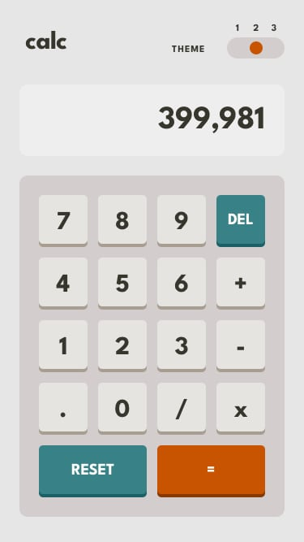

# Calculator-App

## [Design-Figma](https://www.figma.com/file/wlEKgsOB7Y9rOT957Elroy/calculator-app?type=design&node-id=0-215&t=rN7RpdBpkNt5t3UM-0)

## [Live URL](https://calculator-app-dusky-theta.vercel.app)

## Made with

### Vite

### React

### Typescript

### Styled Components

### mathjs

## How to download

### 1. Clone repository

### 2. Go into project folder

### 3. run "npm install" in terminal to download node modules

### 4. run "npm install styled-components" to install styled-components ("yarn add styled-components" if you use yarn) + run "npm install --save-dev @types/styled-components" to install TypeScript definitions on DefinitelyTyped

### 5. run "npm install mathjs" to install math library

### 6. run "npm run dev" in terminal to start live server
